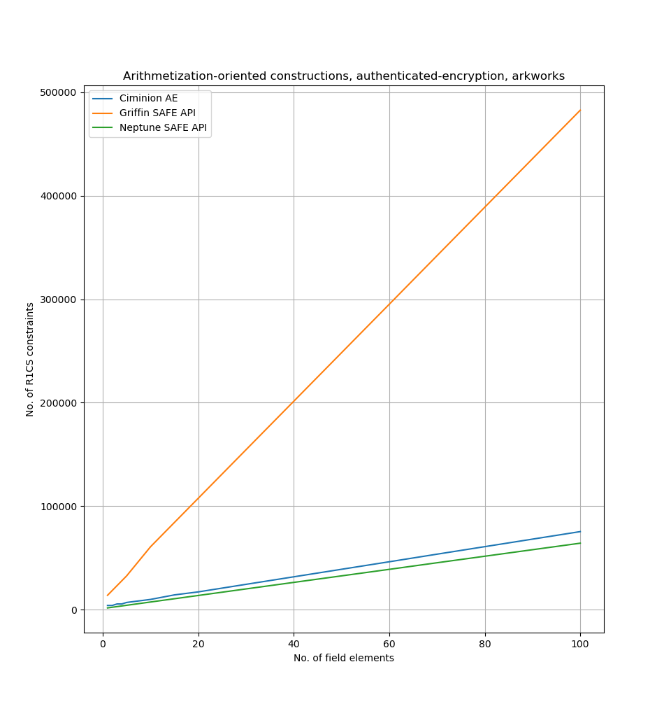
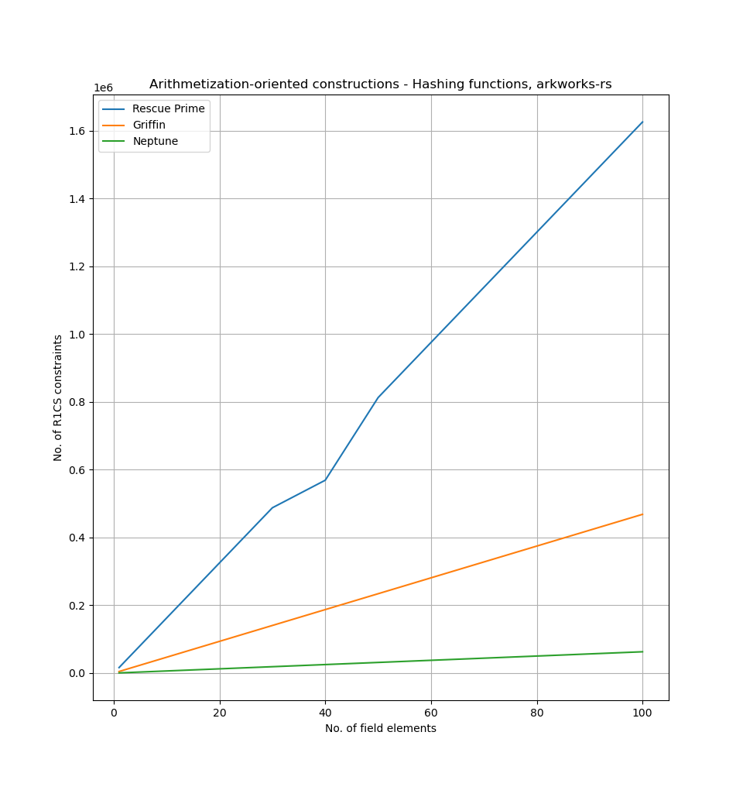

# zekrom for arkworks-rs


zekrom is an open-source library of arithmetization-oriented constructions for zkSNARK circuits.
It was created as part of the MSc thesis work of Laurent Thoeny at Kudelski Research. 
The goal of zekrom is to analyze the performance of novel constructions for circuits using modern libraries such as arkworks-rs and halo2.

zekrom for arkworks-rs supports the following constructions for hashing:

- [Griffin](https://eprint.iacr.org/2022/403)
- [Neptune](https://eprint.iacr.org/2021/1695)
- [Rescue Prime](https://eprint.iacr.org/2020/1143)

and the follow constuctions for performing authenticated-encryption:

- [Ciminion AE](https://eprint.iacr.org/2021/267)
- Griffin via [SAFE API](https://hackmd.io/bHgsH6mMStCVibM_wYvb2w?view)
- Neptune via [SAFE API](https://hackmd.io/bHgsH6mMStCVibM_wYvb2w?view)

zekrom was presented at [Pass the Salt 2023](https://cfp.pass-the-salt.org/pts2023/talk/LQ7RVH/) and appeared at https://research.kudelskisecurity.com/2023/05/30/presenting-zekrom-a-library-of-arithmetization-oriented-constructions-for-zksnark-circuits-part-1-arkworks-rs/

You can download the slides we used at https://cfp.pass-the-salt.org/media/pts2023/submissions/LQ7RVH/resources/PTS2023-Talk-17-zekrom_b2rCSlW.pdf

**Caution: zekrom is under heavy development and it has not been audited by a third party.**

# Running the tests

You can run the tests for each implementation via `cargo test`. They use both
the Groth16 and Marlin proving systems. 

# Generating new parameters

Typically, arithmetization-oriented constructions require to generate different parameters prior to
implementation and deployment of the primitive. In order to help practitioners to generate them,
we have added different helper functions in `parameters.sage`.

1. **Griffin**

The round constants, `alpha` and `beta` parameters for a prime `p` can be obtained via:

```python
def get_params_griffin(p, seed, m, n):
    shake = SHAKE128.new()
    shake.update(bytes("Griffin", "ascii"))
    for v in seed:
        shake.update(bytes(v));
    consts = get_n_random_elements(p, n*m, shake)
    alpha, beta = get_alpha_beta(p, shake)
    return alpha, beta, consts
```

2. **Neptune**

The round constants for Neptune for a prime `p`, can be obtained via:

```python
def get_round_constants_neptune(p, seed, m, n):
    shake = SHAKE128.new()
    shake.update(bytes("Neptune", "ascii"))
    for v in seed:
        shake.update(bytes(v))
    consts = get_n_random_elements(p, n*m, shake)
    gamma = get_random_element(p, shake)
    int_matrix = get_n_random_elements(p, m, shake)
    return consts, gamma, int_matrix
```

Further, the number of external and internal rounds for a power map
exponent `d`, a prime `p`, `t` field elements and s security level can be obtained via:

```python
def get_nb_rounds_neptune(d, p, t, s):
    re = 6    
    ri_p_1 = ceil((min(s, math.log(p,2)) - 6)/math.log(d, 2) + 3 + t + log(t, d))
    ri_p_2 = ceil((s/2) - 4*t - 2)
    
    return re, ceil(1.125 * max(ri_p_1, ri_p_2))
```

3. **Ciminion**

The round constants for `n` rounds Ciminion can be obtained via:

```python
def get_round_constants_ciminion(p, n):
    shake = SHAKE256.new()
    shake.update(bytes(f"GF({p})", "ascii"))
    return get_n_random_elements(p, 4*n, shake, True)
```

4. **Rescue Prime**

The round constants can be generated for a prime `p`, sponge capacity,
security level and `n` rounds via:

```python
def get_round_constants_rescue(p, m, capacity, security_level, n):
    shake = SHAKE256.new()
    shake.update(bytes("Rescue-XLIX (%i,%i,%i,%i)" % (p, m, capacity, security_level), "ascii"))
    return get_n_random_elements(p, m*n, shake)
```

The number of rounds can be estimated via:

```python
def get_number_of_rounds_rescue(p, m, c, s, d):
    r = m - c
    def dcon(N): return floor(0.5 * (d-1) * m * (N-1) + 2)
    def v(N): return m*(N-1)+r
    target = 2 ** s
    for l1 in range(1, 25):
        if binomial(v(l1) + dcon(l1), v(l1)) ** 2 > target:
            break
    return ceil(1.5*max(5, l1))
```

## Number of constraints (R1CS, BLS-12-381)

In order to analyze the performance of our implementations, we have obtained
the number of required R1CS constraints for each construction. This can be
visualized, according to the number of field elements in the message in each test,
via `cargo test`, for instance:

```bash
cargo test rescue_prime::tests::groth16_bls381 -- --nocapture
```

### Ciminion AE

| No. of field elements | No. of R1CS Constraints |
| --------------------- | ----------------------- |
| 1 | 4236 |
| 2 | 4243 |
| 3 | 5692 |
| 4 | 5695 |
| 5 | 7145 |
| 10 | 10062 |
| 15 | 14434 |
| 20 | 17343 |
| 30 | 24640 |
| 40 | 31905 |
| 50 | 39170 |
| 60 | 46435 |
| 70 | 53764 |
| 80 | 61029 |
| 90 | 68294 |
| 100 | 75559 |

### Griffin Hash

| No. of field elements | No. of R1CS Constraints |
| --------------------- | ----------------------- |
| 1 | 4682 |
| 2 | 9365 |
| 3 | 14048 |
| 4 | 18731 |
| 5 | 23414 |
| 10 | 46829 |
| 15 | 70244 |
| 20 | 93659 |
| 30 | 140489 |
| 40 | 187319 |
| 50 | 234149 |
| 60 | 280979 |
| 70 | 327809 |
| 80 | 374639 |
| 90 | 421469 |
| 100 | 468299 |

### Griffin AE

| No. of field elements | No. of R1CS Constraints |
| --------------------- | ----------------------- |
| 1 | 14049 |
| 2 | 18736 |
| 3 | 23419 |
| 4 | 28102 |
| 5 | 32785 |
| 10 | 60891 |
| 15 | 84322 |
| 20 | 107737 |
| 30 | 154599 |
| 40 | 201429 |
| 50 | 248259 |
| 60 | 295089 |
| 70 | 341983 |
| 80 | 388813 |
| 90 | 435643 |
| 100 | 482473 |

### Neptune Hash

| No. of field elements | No. of R1CS Constraints |
| --------------------- | ----------------------- |
| 1 | 622 |
| 2 | 1251 |
| 3 | 1880 |
| 4 | 2509 |
| 5 | 3138 |
| 10 | 6283 |
| 15 | 9428 |
| 20 | 12573 |
| 30 | 18863 |
| 40 | 25153 |
| 50 | 31443 |
| 60 | 37733 |
| 70 | 44023 |
| 80 | 50313 |
| 90 | 56603 |
| 100 | 62893 |

### Neptune AE

| No. of field elements | No. of R1CS Constraints |
| --------------------- | ----------------------- |
| 1 | 1882 |
| 2 | 2516 |
| 3 | 3146 |
| 4 | 3776 |
| 5 | 4406 |
| 10 | 7564 |
| 15 | 10730 |
| 20 | 13880 |
| 30 | 20212  |
| 40 | 26512 |
| 50 | 32812 |
| 60 | 39112 |
| 70 | 45476 |
| 80 | 51776 |
| 90 | 58076 |
| 100 | 64376 |

### Rescue Prime Hash

| No. of field elements | No. of R1CS Constraints |
| --------------------- | ----------------------- |
| 1 | 16249  |
| 2 | 32504 |
| 3 | 48759 |
| 4 | 65014 |
| 5 | 81269 |
| 10 | 162544  |
| 15 | 243819 |
| 20 | 325094 |
| 30 | 487644 |
| 40 | 568919  |
| 50 | 812744 |
| 60 | 975294 |
| 70 | 1137844 |
| 80 | 1300394  |
| 90 | 1462944 |
| 100 | 1625494 |

### Summary



